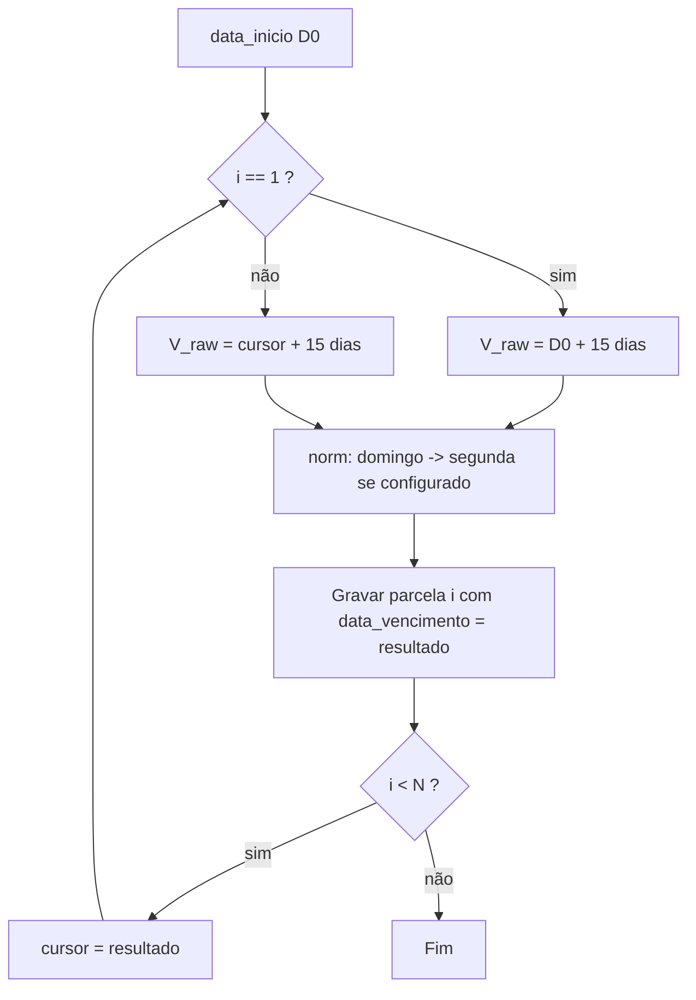

# Frequência quinzenal (+15 dias corridos)

Documento de **desenho e contrato** para implementação de `frequencia = quinzenal` nos empréstimos.  
**Decisão de produto:** “quinzenal” = **intervalo de 15 dias corridos** entre vencimentos consecutivos (não “2 semanas” / 14 dias, nem quinzena de folha 15/último dia do mês).

---

## 1. Objetivo

- Permitir cadastro e persistência de empréstimos com parcelas vencendo **a cada 15 dias corridos**.
- Manter **paridade de políticas** já existentes:
  - **Domingo:** mesma regra dos demais (`deslocar_vencimento_domingo` + `normalizarDataVencimentoCursor` após cada data calculada).
  - **Renovação (1 parcela, só juros):** mesmo grupo que **semanal/diária** — renovação permitida **só** com parcela em vencimento ou **atrasada** (não antecipar como no mensal).
- **Não** usar `dia_primeira_parcela_override` (exclusivo do **mensal**).
- **Não** usar `proximoMesMesmoDia` para quinzenal.

---

## 2. Definição formal do cronograma

Sejam:

- `D0` = `data_inicio` do empréstimo (início do contrato; a 1ª parcela **não** vence em `D0`, como nas outras frequências).
- `N` = `numero_parcelas`.
- `norm(D)` = data após aplicar a política de domingo do empréstimo (se ativa, domingo → segunda; senão, `D` inalterado).

### 2.1 Primeira parcela

```
V1_raw = D0 + 15 dias corridos
V1 = norm(V1_raw)
```

### 2.2 Parcelas seguintes (i = 2 … N)

O cursor entre iterações é sempre a **data já normalizada** da parcela anterior (igual ao espírito do loop atual em `gerarParcelasSimples` / `gerarParcelasPrice`).

```
Vi_raw = V(i-1) + 15 dias corridos
Vi = norm(Vi_raw)
```

**Observação:** com isso, o intervalo entre vencimentos **gravados** pode ser 15 ou 16 dias corridos quando a normalização de domingo empurra uma data para segunda; isso é **consistente** com diária/semanal/mensal no sistema hoje.

---

## 3. Diagrama de fluxo (geração)



---

## 4. Diferença explícita: 15 dias × 2 semanas

| Critério | +15 dias corridos (este doc) | +2 semanas (14 dias) |
|----------|------------------------------|----------------------|
| Passo em código | `addDays(15)` | `addWeeks(2)` ou `addDays(14)` |
| Dia da semana | **Varia** ao longo do cronograma | **Preservado** (mesmo weekday) |
| Alinhamento ao “semanal” no código | Mesmo **formato de switch** que semanal, **outro** delta temporal | Espelho direto do semanal |

Implementação deve seguir **este documento** (`addDays(15)`), não `addWeek`.

---

## 5. Integração com módulos existentes

### 5.1 `EmprestimoService`

- **`gerarParcelasSimples`:** incluir `case 'quinzenal'` no `switch` da primeira parcela e no loop das demais (`addDays(15)`). Garantir que frequências desconhecidas **não** caiam no `default` que chama `proximoMesMesmoDia`.
- **`gerarParcelasPrice`:** idem nos dois `switch` (parcela 1 e i > 1); no bloco “não mensal” da 1ª parcela, incluir `quinzenal` (hoje só listam `diaria` e `semanal` no `switch` interno).
- Após cada cálculo de `dataVencimento`, manter chamada a `normalizarDataVencimentoCursor($emprestimo, $dataVencimento)`.
- **Renovação:** o trecho que ajusta `data_vencimento` da nova parcela **só** para `mensal` (`proximoMesMesmoDia`) **não** se aplica à quinzenal; para quinzenal, a data gerada por `gerarParcelas` já segue a regra acima (como semanal/diária).

### 5.2 `CorrecaoVencimentoDomingoLegadoService`

- `cursorInicial`: após `data_inicio`, para quinzenal → **+15 dias**, depois `normalizarSemDomingo`.
- `avancarCursor`: no `match ($frequencia)`, incluir `'quinzenal' => $cursor->copy()->addDays(15)` — **evitar** `default` cair em lógica mensal.

### 5.3 Banco de dados

- Nova migration: estender o `enum` (ou equivalente) de `emprestimos.frequencia` com o valor **`quinzenal`**.  
- Ajustar migration base só se a equipe versionar schema do zero; em geral **só** migration incremental.

### 5.4 Validação e API de formulário

- `EmprestimoController`: `in:diaria,semanal,mensal,quinzenal`.
- `VendaController` / `VendaService`: idem para crediário, se aplicável.

### 5.5 Views e JS

- `resources/views/emprestimos/create.blade.php`: opção “Quinzenal”; em `inicializarCursorPrimeiraParcela` e `avancarCursorVencimento`, ramo quinzenal com **+15 dias** para bater com o backend.
- Relatórios / selects / `freqLabels`: incluir `quinzenal` => rótulo **“Quinzenal”** (ou “Quinzenal (15 dias)”, se quiserem deixar explícito na UI).

### 5.6 UI condicional (mensal / diária)

- Onde a regra é “só mensal” (ex.: checkbox 1ª parcela 30/03, `ehMensal`), **não** incluir quinzenal.
- Onde “não mensal” se comporta como semanal (renovação, adiantamento, etc.), tratar **quinzenal junto de semanal/diária** conforme já discutido — com a única diferença sendo o **motor de datas** (+15 dias).

---

## 6. Testes sugeridos (aceite)

1. **Sequência simples:** `data_inicio` = segunda, `deslocar_vencimento_domingo` desligado, 3 parcelas — verificar saltos de 15 dias.
2. **Cruzamento com domingo:** data base leva a vencimento em domingo com flag ligada — segunda, próximo +15 a partir dessa segunda.
3. **Price e simples:** mesma `data_inicio` e `N`, comparar datas entre os dois geradores.
4. **Correção legado domingo:** empréstimo quinzenal com parcelas em domingo e fluxo de remontagem — cursor inicial e `avancarCursor` com +15 dias.
5. **Renovação 1x:** quinzenal, parcela **não** atrasada → deve bloquear; atrasada → permitir (igual semanal).

---

## 7. Checklist rápido de arquivos

| Área | Arquivo (principal) |
|------|---------------------|
| Schema | nova `database/migrations/*_add_quinzenal_frequencia*.php` |
| Parcelas | `app/Modules/Loans/Services/EmprestimoService.php` |
| Legado domingo | `app/Modules/Loans/Services/CorrecaoVencimentoDomingoLegadoService.php` |
| Validação | `EmprestimoController`, `VendaController`, `VendaService` |
| Criação + simulador | `resources/views/emprestimos/create.blade.php` |
| Relatórios / labels | `RelatorioController`, views `relatorios/*`, `liberacoes/index`, `SolicitacaoNegociacao` |
| Crediário UI | `resources/views/vendas/create.blade.php` |
| Testes | `tests/Feature` ou `tests/Unit` novos casos quinzenal |

---

## 8. Glossário

- **15 dias corridos:** inclusão de fins de semana e feriados na contagem; **não** “15 dias úteis”.
- **Quinzenal (este doc):** periodicidade por **+15 dias** entre vencimentos normalizados, **não** o calendário comercial “dia 15 e fim do mês”.

---

*Última atualização: documento de desenho para implementação imediata; alinhar código e CHANGELOG quando a feature for mergeada.*
